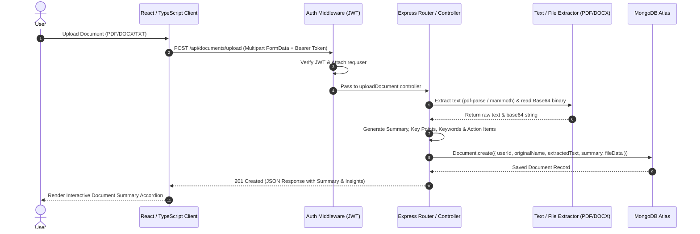

# AI Workspace — Comprehensive Technical Project Documentation & Interview Preparation Guide

---

## 1. Executive Summary & System Architecture

### 1.1 Project Overview
**AI Workspace** is an enterprise-grade, full-stack Personal Productivity & AI-Assisted Document Workspace built on the **MERN (MongoDB, Express, React, Node.js)** stack with **TypeScript** and **Vite**. 

The platform unifies document summarization, file management with dual-tier binary database storage, task kanban boards with dynamic progress tracking, smart notes with automatic word-count analytics, voice notes transcription, global text-index search, and an admin management dashboard.

```
+-----------------------------------------------------------------------------------+
|                                  CLIENT LAYER                                     |
|           React 18 + TypeScript + Vite + Tailwind CSS + Lucide Icons              |
|        State Management: Context API | HTTP Client: Axios + Interceptors          |
+-----------------------------------------------------------------------------------+
                                         |
                                  REST API / HTTP
                                         |
+-----------------------------------------------------------------------------------+
|                                  SERVER LAYER                                     |
|             Node.js + Express.js + Helmet + CORS + Rate Limiting                  |
|     Security: JWT Auth (Bearer) | Password Hashing: Bcrypt.js (12 Rounds)     |
|   File Processing: Multer + PDF-Parse + Mammoth Text Extraction Engine            |
+-----------------------------------------------------------------------------------+
                                         |
                                    ODM / Driver
                                         |
+-----------------------------------------------------------------------------------+
|                                 DATABASE LAYER                                    |
|        MongoDB Atlas (Primary) <---> Local MongoDB Instance (Fallback)            |
|       Collections: Users, Notes, Tasks, Documents, Files, VoiceNotes              |
+-----------------------------------------------------------------------------------+
```

---

### 1.2 System Sequence & Data Flow



---

## 2. Complete Module-by-Module Technical Breakdown

---

### Module 1: Authentication & Security Module

#### Architectural Purpose
Handles user identity management, password encryption, stateful/stateless JWT token issuance, session verification, and password reset workflows via token hashing.

#### Files & Location
- Controller: [authController.js](file:///c:/Users/mnara/OneDrive/Desktop/AIWorkSpace/server/src/controllers/authController.js)
- Routes: [auth.js](file:///c:/Users/mnara/OneDrive/Desktop/AIWorkSpace/server/src/routes/auth.js)
- Model: [User.js](file:///c:/Users/mnara/OneDrive/Desktop/AIWorkSpace/server/src/models/User.js)
- Middleware: [auth.js](file:///c:/Users/mnara/OneDrive/Desktop/AIWorkSpace/server/src/middleware/auth.js)

#### Schema Definition (`User.js`)
```javascript
{
  name: { type: String, required: true },
  email: { type: String, required: true, unique: true, lowercase: true },
  password: { type: String, required: true, select: false },
  avatar: { type: String, default: null },
  role: { type: String, enum: ['user', 'admin'], default: 'user' },
  theme: { type: String, enum: ['dark', 'light', 'system'], default: 'dark' },
  isActive: { type: Boolean, default: true },
  resetPasswordToken: String,
  resetPasswordExpire: Date,
  lastLogin: Date
}
```

#### Functions & Technical Methods

1. `userSchema.pre('save')`
   - **Theoretical Concept**: Mongoose Middleware Hook (Pre-Save).
   - **Implementation**: Intercepts user document before writing to MongoDB. Checks `if (!this.isModified('password')) return next()`. Uses `bcrypt.hash(this.password, 12)` to apply salted password hashing with cost factor 12.

2. `userSchema.methods.matchPassword(enteredPassword)`
   - **Theoretical Concept**: Instance Method & Bcrypt Salt Comparison.
   - **Implementation**: Asynchronously compares cleartext password with hashed password stored in DB using `bcrypt.compare()`.

3. `userSchema.methods.getSignedJwt()`
   - **Theoretical Concept**: Stateless Authentication via JSON Web Tokens.
   - **Implementation**: Generates a JWT containing `{ id: this._id, role: this.role }` signed with `process.env.JWT_SECRET` and configured expiration (`JWT_EXPIRE || '7d'`).

4. `register(req, res, next)` — `POST /api/auth/register`
   - Validates existing user by email. Creates user record, updates `lastLogin`, signs JWT, and returns standardized response wrapper.

5. `login(req, res, next)` — `POST /api/auth/login`
   - Fetches user including hidden `+password` field using `.select('+password')`. Verifies password match and active account status (`isActive`).

6. `forgotPassword(req, res, next)` — `POST /api/auth/forgot-password`
   - **Theoretical Concept**: Cryptographic Token Hashing for Password Recovery.
   - **Implementation**: Generates a 32-byte unhashed random string (`crypto.randomBytes(32)`), hashes it using SHA-256 (`crypto.createHash('sha256')`), sets 30-minute expiration, sends unhashed token via Nodemailer, and stores hashed version in DB to prevent DB leak exploitation.

7. `protect(req, res, next)` Middleware
   - **Theoretical Concept**: Bearer Authorization Middleware.
   - **Implementation**: Extracts `Authorization: Bearer <token>` from HTTP request headers. Verifies token integrity via `jwt.verify()`. Attaches decoded user object (`req.user`) to request context.

---

### Module 2: Document Summarizer & Text Extraction Engine

#### Architectural Purpose
Extracts raw text from heterogeneous document formats (PDF, DOCX, TXT), generates heuristic/algorithmic summaries, extracts key points, keywords, and action items, and stores binary payloads in MongoDB.

#### Files & Location
- Controller: [documentsController.js](file:///c:/Users/mnara/OneDrive/Desktop/AIWorkSpace/server/src/controllers/documentsController.js)
- Routes: [documents.js](file:///c:/Users/mnara/OneDrive/Desktop/AIWorkSpace/server/src/routes/documents.js)
- Model: [Document.js](file:///c:/Users/mnara/OneDrive/Desktop/AIWorkSpace/server/src/models/Document.js)

#### Schema Definition (`Document.js`)
```javascript
{
  userId: { type: mongoose.Schema.Types.ObjectId, ref: 'User', required: true, index: true },
  originalName: { type: String, required: true },
  storedName: { type: String, required: true },
  fileUrl: { type: String, required: true },
  mimeType: { type: String, required: true },
  fileSize: { type: Number, required: true },
  extractedText: { type: String, default: '' },
  isProcessed: { type: Boolean, default: true },
  summary: { type: String, default: '' },
  keyPoints: [{ type: String }],
  keywords: [{ type: String }],
  actionItems: [{ type: String }],
  readingTime: { type: String, default: '1 min' },
  fileData: { type: String, default: '' } // Base64 binary payload stored directly in MongoDB
}
```

#### Functions & Technical Methods

1. `extractText(filePath, mimeType)`
   - **Theoretical Concept**: Multi-format Text Stream Parsing.
   - **Implementation**:
     - `application/pdf`: Reads buffer via `fs.readFileSync()` and executes `pdfParse(buffer)`.
     - `application/msword` / `docx`: Executes `mammoth.extractRawText({ path: filePath })`.
     - `text/plain`: Reads text via UTF-8 encoding.

2. `generateSummaryFromText(text, filename)`
   - **Theoretical Concept**: Algorithmic Text Analytics & Heuristic Summarization.
   - **Implementation**:
     - **Sentence Segmentation**: Uses Regex lookbehind `/(?<=[.!?])\s+/` to isolate sentences (>10 chars).
     - **Reading Time**: Calculated via standard 200 WPM formula: `Math.max(1, Math.ceil(wordCount / 200)) + ' min'`.
     - **Keyword Frequency Extraction**: Filters out common stop words using a `Set` data structure (`the`, `and`, `for`, etc.), computes term frequencies across words >3 characters, sorts descending, and returns top 6 keywords.
     - **Action Item Extraction**: Filters sentences matching regex intent patterns `/must|should|need|will|action|task|important|key|ensure|require/i`.

3. `uploadDocument(req, res, next)` — `POST /api/documents/upload`
   - Accepts single file via Multer. Invokes `extractText()`, converts binary stream into Base64 data string (`data:${mimetype};base64,${buffer}`), generates summary insights, sets `isProcessed: true`, and saves into MongoDB.

4. `getDocuments(req, res, next)` — `GET /api/documents`
   - **Theoretical Concept**: Projection Querying & Legacy Self-Healing.
   - **Implementation**: Fetches documents excluding the heavy `fileData` payload using `.select('-fileData')`. Iterates over fetched documents and automatically repairs/populates any legacy documents missing `isProcessed` or `summary` fields.

5. `summarizeDocument(req, res, next)` — `POST /api/documents/:id/summarize`
   - On-demand endpoint allowing users to trigger re-summarization of any stored document.

---

### Module 3: File Manager & Hybrid Cloud/Database File Storage

#### Architectural Purpose
Provides cross-platform file management (upload, organize into folders, star, rename, delete) with a **Dual-Tier Hybrid Storage Strategy** (combining local file system uploads with full MongoDB Base64 binary persistence).

#### Files & Location
- Controller: [filesController.js](file:///c:/Users/mnara/OneDrive/Desktop/AIWorkSpace/server/src/controllers/filesController.js)
- Routes: [files.js](file:///c:/Users/mnara/OneDrive/Desktop/AIWorkSpace/server/src/routes/files.js)
- Model: [File.js](file:///c:/Users/mnara/OneDrive/Desktop/AIWorkSpace/server/src/models/File.js)

#### Schema Definition (`File.js`)
```javascript
{
  userId: { type: mongoose.Schema.Types.ObjectId, ref: 'User', required: true, index: true },
  originalName: { type: String, required: true },
  storedName: { type: String, required: true },
  fileUrl: { type: String, required: true },
  mimeType: { type: String, required: true },
  fileSize: { type: Number, required: true },
  folder: { type: String, default: 'Root', trim: true },
  isStarred: { type: Boolean, default: false },
  tags: [{ type: String }],
  fileData: { type: String, default: '' } // Full binary stored in DB
}
```

#### Functions & Technical Methods

1. `uploadFile(req, res, next)` — `POST /api/files`
   - Handles file upload via Multer disk storage. Reads file buffer into Base64 format and persists both metadata and `fileData` payload directly inside MongoDB.

2. `getFiles(req, res, next)` — `GET /api/files`
   - Supports filter parameters (`folder`, `search` query). Uses `.select('-fileData')` to optimize memory overhead.

3. `getFolders(req, res, next)` — `GET /api/files/folders`
   - **Theoretical Concept**: MongoDB Distinct Querying.
   - **Implementation**: Calls `File.distinct('folder', { userId: req.user._id })` to retrieve unique folder names for directory navigation.

4. `deleteFile(req, res, next)` — `DELETE /api/files/:id`
   - Removes DB document via `findOneAndDelete` and synchronizes file system state by removing local disk file via `fs.unlinkSync()`.

---

### Module 4: Smart Notes & Automatic Word-Count Analytics

#### Architectural Purpose
Provides a digital note-taking system with text styling, color coding, pin/favorite states, archive controls, and automatic pre-save word-count statistics.

#### Files & Location
- Controller: [notesController.js](file:///c:/Users/mnara/OneDrive/Desktop/AIWorkSpace/server/src/controllers/notesController.js)
- Routes: [notes.js](file:///c:/Users/mnara/OneDrive/Desktop/AIWorkSpace/server/src/routes/notes.js)
- Model: [Note.js](file:///c:/Users/mnara/OneDrive/Desktop/AIWorkSpace/server/src/models/Note.js)

#### Schema & Mongoose Pre-Hook
```javascript
noteSchema.pre('save', function (next) {
  this.wordCount = this.content ? this.content.split(/\s+/).filter(Boolean).length : 0;
  next();
});
```
- **Theory**: Guarantees that `wordCount` is computed server-side prior to database insertion or update, maintaining computational efficiency without frontend data trust assumptions.

---

### Module 5: Task Management & Kanban Board Engine

#### Architectural Purpose
Manages complex multi-layered project boards with nested subtasks, status transitions (`todo` -> `in-progress` -> `done`), and automated overall goal progress calculation.

#### Files & Location
- Controller: [tasksController.js](file:///c:/Users/mnara/OneDrive/Desktop/AIWorkSpace/server/src/controllers/tasksController.js)
- Routes: [tasks.js](file:///c:/Users/mnara/OneDrive/Desktop/AIWorkSpace/server/src/routes/tasks.js)
- Model: [Task.js](file:///c:/Users/mnara/OneDrive/Desktop/AIWorkSpace/server/src/models/Task.js)

#### Schema Instance Method (`Task.js`)
```javascript
taskSchema.methods.calculateProgress = function () {
  if (!this.tasks.length) return 0;
  const done = this.tasks.filter((t) => t.status === 'done').length;
  return Math.round((done / this.tasks.length) * 100);
};
```
- **Implementation**: Sums completed items against total tasks in board sub-documents and computes overall goal completion percentage (0–100%).

---

### Module 6: Voice Notes & Web Speech Transcription

#### Architectural Purpose
Persists audio transcription records generated by browser-native Web Speech API, tracking duration and language settings.

#### Files & Location
- Controller: [voiceController.js](file:///c:/Users/mnara/OneDrive/Desktop/AIWorkSpace/server/src/controllers/voiceController.js)
- Routes: [voice.js](file:///c:/Users/mnara/OneDrive/Desktop/AIWorkSpace/server/src/routes/voice.js)
- Model: [VoiceNote.js](file:///c:/Users/mnara/OneDrive/Desktop/AIWorkSpace/server/src/models/VoiceNote.js)

---

### Module 7: Global Search Engine

#### Architectural Purpose
Performs multi-collection full-text searches concurrently across Notes, Tasks, Documents, Files, and Voice Notes using MongoDB Text Indexes.

#### Files & Location
- Controller: [searchController.js](file:///c:/Users/mnara/OneDrive/Desktop/AIWorkSpace/server/src/controllers/searchController.js)
- Route: [search.js](file:///c:/Users/mnara/OneDrive/Desktop/AIWorkSpace/server/src/routes/search.js)

#### Technical Method & Theory
```javascript
const [notes, tasks, documents, files, voiceNotes] = await Promise.all([
  Note.find({ userId, $text: { $search: q } }).limit(5),
  Task.find({ userId, $text: { $search: q } }).limit(5),
  Document.find({ userId, $text: { $search: q } }).limit(5),
  File.find({ userId, $text: { $search: q } }).limit(5),
  VoiceNote.find({ userId, $text: { $search: q } }).limit(5),
]);
```
- **Theory**: Uses `Promise.all()` to execute 5 independent DB text queries in parallel, minimizing total API latency.

---

### Module 8: Admin Console & MongoDB Aggregation Pipeline

#### Architectural Purpose
Provides superuser system monitoring, total user account management (activate/deactivate), and user analytics aggregation.

#### Files & Location
- Controller: [adminController.js](file:///c:/Users/mnara/OneDrive/Desktop/AIWorkSpace/server/src/controllers/adminController.js)
- Routes: [admin.js](file:///c:/Users/mnara/OneDrive/Desktop/AIWorkSpace/server/src/routes/admin.js)

#### Aggregation Pipeline Implementation
```javascript
const taskStatusCounts = await Task.aggregate([
  { $match: { userId } },
  { $unwind: '$tasks' },
  { $group: { _id: '$tasks.status', count: { $sum: 1 } } },
]);
```
- **Theory**:
  - `$match`: Filters tasks belonging to logged-in user.
  - `$unwind`: Deconstructs the `tasks` array field from input documents to output a document for each element.
  - `$group`: Groups documents by task status (`todo`, `in-progress`, `done`) and calculates total count (`$sum: 1`).

---

## 3. Database Connection Fallback & Resiliency Architecture

To ensure high availability in production and local development, [db.js](file:///c:/Users/mnara/OneDrive/Desktop/AIWorkSpace/server/src/config/db.js) implements an automated connection failover:

```
                  +--------------------------------+
                  |  Attempt Connection to Primary |
                  |    MongoDB Atlas Cloud URI     |
                  +--------------------------------+
                                  |
                        Success? / \ Failure (Timeout / Network issue)
                       +--------+   +----------------------------------+
                       |             |  Attempt Fallback Connection to |
                       v             |  Local DB (mongodb://127.0.0.1) |
             Connected to Atlas      +----------------------------------+
                                                     |
                                           Success? / \ Failure
                                          +--------+   +-----------------------+
                                          |             |  Graceful Degraded   |
                                          v             |  Mode (API logs warning|
                                 Connected Local DB     |  & handles DB errors)  |
                                                        +-----------------------+
```

---

## 4. Frontend Component Architecture

Built with **React 18**, **TypeScript**, **Vite**, **Tailwind CSS**, **Framer Motion**, and **Lucide Icons**:

- **[App.tsx](file:///c:/Users/mnara/OneDrive/Desktop/AIWorkSpace/client/src/App.tsx)**: Manages main routing, protected route guards (`ProtectedRoute`, `AdminRoute`), sidebar layout, and theme context provider.
- **[axios.ts](file:///c:/Users/mnara/OneDrive/Desktop/AIWorkSpace/client/src/lib/axios.ts)**: Configured Axios instance with request interceptors that inject the JWT `Authorization: Bearer <token>` header into every outgoing API request.
- **Pages**:
  - `DocumentsPage.tsx`: Drag-and-drop document upload via `react-dropzone`, accordion display for summaries, keywords, action items, and database download triggers.
  - `FilesPage.tsx`: Folder selection tabs, grid/list view toggle, star toggle, file renaming inline modal, and direct DB binary download.
  - `TasksPage.tsx`: Kanban task board interface with subtask checkboxes and interactive progress bars.
  - `NotesPage.tsx`: Searchable pinned/archived note board with tag filters and color accents.
  - `AdminPage.tsx`: Real-time analytics dashboard with user activation toggle switches.

---

## 5. Comprehensive Interview Preparation Guide

### 5.1 The 30-Second Elevator Pitch
> *"AI Workspace is a full-stack MERN platform built with TypeScript and Vite designed for document summarization, productivity tracking, and cloud file storage. It processes PDFs, Word documents, and text files using automated text extraction algorithms to deliver instant AI summaries, key points, and action items. Additionally, it features a dual-tier hybrid storage strategy that persists files in both disk storage and MongoDB Base64 payloads, full kanban task boards with dynamic progress metrics, multi-collection parallel search using MongoDB text indexes, and an administrative aggregation pipeline."*

---

### 5.2 Top 15 Technical Interview Questions & Model Answers

#### Q1: How did you implement authentication in this application?
**Model Answer**:
> *"Authentication is stateless and handled via JSON Web Tokens (JWT) and Bcrypt.js password hashing. Upon registration or login, the user's password is encrypted using Bcrypt with a salt round factor of 12 inside a Mongoose `pre('save')` hook. The server signs a JWT containing the user's ID and role using a secret key. On the frontend, an Axios interceptor attaches this token as a `Bearer` header to all HTTP requests. The custom `protect` middleware on the backend extracts and verifies the token using `jwt.verify()` before granting access to protected controllers."*

#### Q2: How does your Document Summarization engine work under the hood?
**Model Answer**:
> *"When a user uploads a document (PDF, DOCX, or TXT), Multer passes the file stream to our text extraction engine. We use `pdf-parse` for PDFs and `mammoth` for DOCX files to extract raw plain text. The extracted text is then processed through an algorithmic text analytics pipeline: sentence segmentation is performed using regex lookbehinds, reading time is calculated using standard word-per-minute metrics, and keywords are extracted by stripping common stop words using a JavaScript `Set` and ranking word frequencies. Key insights and action items are identified by scanning for modal verbs and task indicators."*

#### Q3: How do you handle file storage, and why did you choose a dual-tier hybrid approach?
**Model Answer**:
> *"We implemented a dual-tier hybrid file storage strategy. When a file is uploaded, Multer writes it to the local server disk for static serving, while simultaneously, the server converts the file buffer into a Base64 encoded string (`fileData`) and stores it directly inside the MongoDB document. This guarantees high reliability—if the local server disk is wiped or running in a stateless container, the file payload remains fully intact and downloadable directly from MongoDB Atlas."*

#### Q4: How do you prevent large Base64 files from slowing down database queries?
**Model Answer**:
> *"Storing binary data in MongoDB can bloat document payload size. To ensure queries remain fast, we use Mongoose Projection query filtering. In `getDocuments` and `getFiles`, we execute `.select('-fileData')`. This tells MongoDB to omit the heavy binary string when fetching list views, ensuring response payloads remain small and fast. The `fileData` field is only fetched when a user explicitly requests to download or view a specific file."*

#### Q5: What is the purpose of `Promise.all()` in your Global Search controller?
**Model Answer**:
> *"Our Global Search controller queries 5 separate MongoDB collections (Notes, Tasks, Documents, Files, and VoiceNotes) concurrently using MongoDB `$text` search indexes. Instead of awaiting each query sequentially—which would cause additive latency (`T1 + T2 + T3 + T4 + T5`)—we wrap all 5 database calls inside `Promise.all()`. This executes the queries in parallel, reducing total request latency to the duration of the single slowest query (`max(T1..T5)`)."*

#### Q6: How do you compute task board progress dynamically?
**Model Answer**:
> *"Each Task board document in MongoDB contains an array of nested sub-task items. Rather than recalculating progress manually across multiple API routes, we attached a custom schema instance method `calculateProgress()` to the Mongoose schema. Whenever a subtask or item status is toggled, the controller invokes `task.calculateProgress()`, which filters completed items against total items, calculates the percentage, and updates the `progress` field."*

#### Q7: How does your database resiliency/fallback mechanism work?
**Model Answer**:
> *"In `server/src/config/db.js`, we implemented an automated database failover handler. Upon server boot, Mongoose attempts to connect to the primary MongoDB Atlas cloud URI with a 5-second timeout. If the primary connection fails (e.g. due to IP whitelist restrictions or network downtime), the catch block automatically catches the error and attempts a fallback connection to a local MongoDB instance (`mongodb://127.0.0.1:27017/ai-workspace`). If both fail, it logs a warning and enters a degraded mode rather than crashing the Node process."*

#### Q8: How did you fix the issue where uploaded documents were displaying "Processing failed"?
**Model Answer**:
> *"The frontend component `DocumentsPage.tsx` was checking `!doc.isProcessed` to display a 'Processing failed' badge. However, the original MongoDB `Document` schema lacked the `isProcessed`, `summary`, `keyPoints`, `keywords`, and `actionItems` fields, causing `doc.isProcessed` to evaluate as `undefined` (falsy). To resolve this, I updated the Mongoose Document schema to include all analytics fields with default values, updated the controller to set `isProcessed: true` upon text extraction, created an automated repair loop in `getDocuments` to fix existing legacy records, and implemented the missing `/api/documents/:id/summarize` endpoint."*

#### Q9: What is MongoDB `$unwind` and how is it used in your Admin Dashboard controller?
**Model Answer**:
> *"`$unwind` is an aggregation stage in MongoDB that deconstructs an array field from input documents to output a document for each element in that array. In our Admin controller, we use `$unwind: '$tasks'` to flatten all nested task items across all user boards into a single stream. This allows the subsequent `$group` stage to aggregate task counts by status (`todo`, `in-progress`, `done`) across the entire user base."*

#### Q10: How do you ensure secure password resets without storing cleartext tokens in the database?
**Model Answer**:
> *"When a user requests a password reset, we generate a 32-byte random cryptographic token using `crypto.randomBytes(32)`. We send the unhashed version of this token to the user's email address via Nodemailer. Before saving the record to MongoDB, we hash the token using SHA-256 (`crypto.createHash('sha256')`) and store only the hashed version along with an expiration timestamp. When the user submits their new password with the token, we hash the incoming token and compare it with the stored hash. This prevents attackers from resetting user passwords even if the database is compromised."*

#### Q11: How do you handle CORS and Rate Limiting in Express?
**Model Answer**:
> *"We use `cors()` configured with explicit origins (`process.env.CLIENT_URL`), allowed methods (`GET`, `POST`, `PUT`, `DELETE`, `PATCH`), allowed headers, and `credentials: true`. For rate limiting, we use `express-rate-limit` configured to allow a maximum of 500 requests per 15-minute window per IP address across all `/api` routes to protect the server against brute-force attacks and denial-of-service attempts."*

#### Q12: Why did you use Mongoose Pre-Save hooks for note word count calculations instead of frontend calculation?
**Model Answer**:
> *"Relying on client-side calculations for database fields creates data integrity risks if a request bypasses the client application (e.g. via direct API calls). By implementing a Mongoose `pre('save')` middleware hook on `Note.js`, the word count calculation is enforced at the data layer every time a note is created or updated, ensuring consistent data integrity across the system."*

#### Q13: How does your Vite + React + TypeScript environment improve development efficiency over Create React App (CRA)?
**Model Answer**:
> *"Vite leverages native ES module imports in development and uses `esbuild` for fast module bundling. Unlike CRA (which uses Webpack and bundles the entire application before serving), Vite provides near-instantaneous hot module replacement (HMR) and fast cold-start build times. Coupled with TypeScript, it provides compile-time type safety, automated type checking, and intelligent IDE autocompletion."*

#### Q14: What is the purpose of `skipLibCheck` and `composite: true` in your TypeScript configuration?
**Model Answer**:
> *"`skipLibCheck: true` skips type checking of declaration files (`.d.ts`), reducing overall TypeScript compilation time. `"composite": true` in `tsconfig.node.json` enables TypeScript project references, allowing multi-project configurations (e.g., separating Vite build config from client application code) to be compiled incrementally and modularly."*

#### Q15: How do you manage global UI notifications and loading states in React?
**Model Answer**:
> *"We use `react-hot-toast` for user-facing status feedback (e.g. upload success, deletion confirmation, API error messages). Component-level asynchronous operations (such as document upload or text summarization) track loading state using React `useState` hooks paired with `Loader2` spinners from `lucide-react`, ensuring visual feedback during long-running tasks."*
